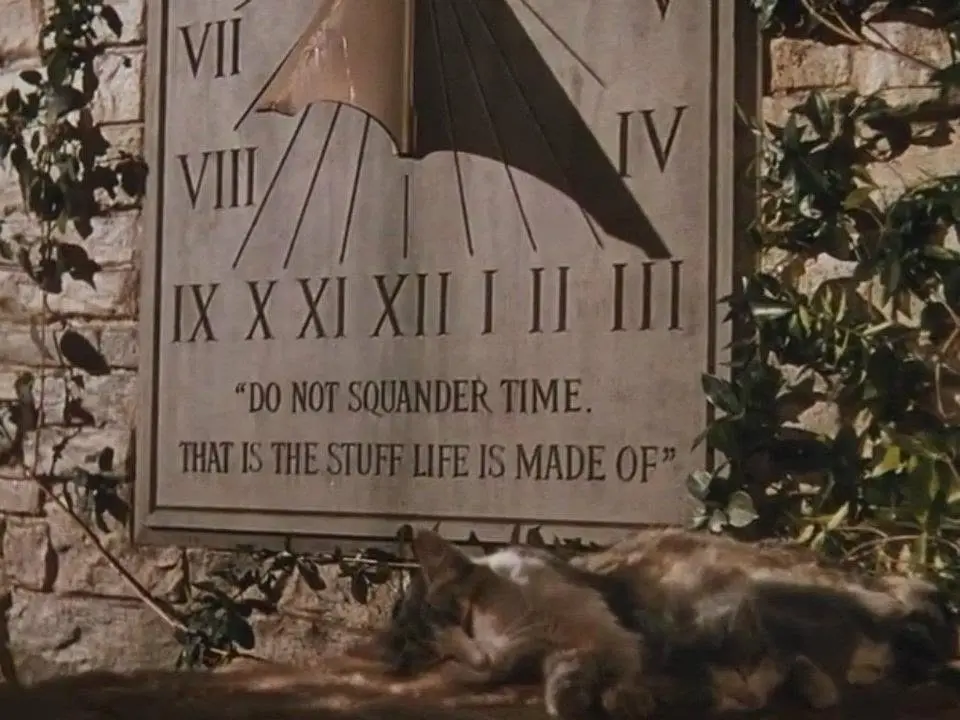

# daykeep

daykeep keeps time as decimal days: a day number plus a fraction of a day,
counted from day 0 = 2000-01-01 00:00 UTC. A day defaults to 86,400 seconds,
so 90 minutes is `.0625`.



Read [The Sovereign Day](MANIFESTO.md), the manifesto behind daykeep's
personal approach to time.

## Usage

```console
$ daykeep .9 - .1
.2000
$ daykeep --hm '09:00 - 10:30' 11:00 - 11:45
1h 30m
2h 15m
$ daykeep --now
09761.4564
$ daykeep --convert .5 9 +9 10:00
2026-09-22 09:00:00 -0300
2026-09-19 21:00:00 -0300
2026-09-29 21:00:00 -0300
09761.5417
```

It sums ranges, tracks time interactively, and converts between decimal
stamps and civil clocks. See `daykeep --help`, `man daykeep`, or `info
daykeep` for the full manual.

### Configure your day

Set `--epoch=DATE`, `DAYKEEP_EPOCH`, or `epoch = DATE` in
`~/.config/daykeep/config` to choose day 0. Set `--day-length=SECONDS`,
`DAYKEEP_DAY_LENGTH`, or `day_length = SECONDS` to choose a personal day
length from 1 through 1,000,000,000 seconds. Each setting independently uses
the command line, then the nonempty environment variable, then the config
file, then its default.

```ini
epoch = 2000-01-01 03:00 -0300
day_length = 90000
```

That day lasts 25 hours, starting at the fixed epoch you chose. Subsequent
boundaries are exactly 90,000 seconds apart. Civil dates, `HH:MM`, and
hour/minute output keep their usual meanings. Logs store decimal stamps, so
read or resume them with the epoch and day length used to write them.

### Tracker

`daykeep --track` (`-t`) is an interactive tracker:

```console
$ daykeep -t -a work.log
 1  09761.3750 - 09761.4375   .0625
 2  09761.4564 - ...          (running)
total .0625
[enter] stamp  [x] remove last  [e] edit last  [s] save  [q] quit
```

- Enter stamps the current time. Stamps start and end entries in turn.
- `e` edits the last stamp; `x` removes it; `q`, `^C`, `^D`, or end of input
  quit.
- With `-a LOG`, entries are written as `START - END` lines and the log is
  rewritten after every change. An open last entry resumes in the next
  `-t -a LOG` session. Only one tracker can use a log at a time.
- Without `-a`, nothing is written to disk.

## Building

Requires gcc with glibc. In a git checkout, documentation also needs
`help2man` and `makeinfo`; release tarballs include the generated files.

```sh
make              # build daykeep
make test         # shell test suite
make check        # alias for make test
make verify       # Z3 proofs and compiled model checks
make fuzz         # seeded model and robustness fuzzing
make fuzz-asan    # fuzzing against ASan + UBSan
make fuzz-libfuzzer FUZZ_RUNS=2000000
make doc          # man page and Info manual
make install
make distcheck
```

`make install` honors `prefix`, `bindir`, `mandir`, `infodir`,
`bashcompdir`, and `DESTDIR`.

## Verification

`verify/dkprove.py` proves daykeep's digit completion, range-end rollover,
and rounding rules over a model of the time library. Seeded compiled checks
connect that model to `src/dktime.c` across ten representative day lengths.
`verify/fuzz.py` exercises sum mode, conversion, invalid input, write errors,
and tracker persistence against independent models. See
[verify/README.md](verify/README.md) for scope and trusted assumptions.

## License

GPLv3 or later; see [`COPYING`](COPYING). The manual, Makefile, and bash
completion are all-permissive. [`NEWS`](NEWS) lists user-visible changes;
[`AUTHORS`](AUTHORS) and [`THANKS`](THANKS) credit contributors and projects.
